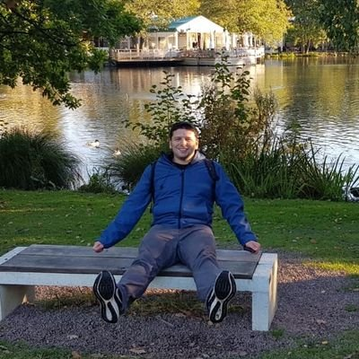

 

My name is Alex Murphy. I am currently pursuing a PhD at the **Cognitive Computational Neuroimaging Group** at the **University of Birmingham** under the supervision of Uta Noppeney and Bernd Bohnet. My two main research interests are (a) the neural underpinnings and representation of language, how this is carried out in the brain and (b) deep learning approaches to Natural Language Processing (NLP). My PhD research lies at the intersection of these fields, examining how neural data (EEG, fMRI, MEG) can help enhance NLP algorithms as well as how insights from NLP might help us to better understand the neural basis of linguistic computation. In 2018 I spent 4 months as an intern on the Language Team at **Google Brain** in London. I'm also interested in machine learning more broadly: linear algebra, algorithmic analysis, data structures and programming. When not on a computer, I'm probably reading a book about aviation or taking flying lessons.

Before starting my PhD, I earned a Master's of Science at the University of Copenhagen in **IT & Cognition**. Prior to this I spent two years studying at both the University of Iceland and Reykjavík Univeristy for a Master's in **Language Technology**. I also previously earned a Bachelor's degree in **Linguistics** at Bangor University (Wales).
